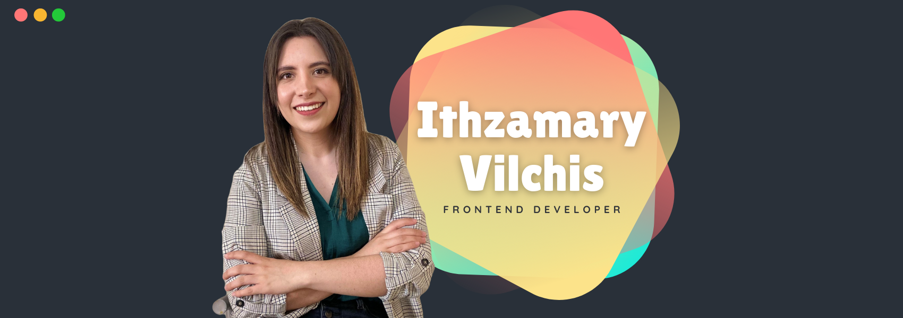

<h1 align=center>Hello Im Ithza  👋</h1>

<b>Welcome, It's a pleasure to meet you</b>

  
  
   
  

✉️ email me: vgithzamary@gmail.com

---

### 🌟About me
- I'm Frontend developer and Application Subject Matter Expert in Agile.
- I love design and develop web applications and I consider myself as a forever learner.
- Since April 2021 I'm Platzi Master student where I've been learning a lot about frontend technologies and softskills.
- I'm currently working in my personal blog [ithza.com](https://ithza.com/ "ithza.com")

---

### 💚 Platzi Master Projects
- 🛍️ [The Marketplace](https://the-market-place-eta.vercel.app/)
- 🎮 [Roomba Game](jovial-torvalds-8bac6f.netlify.app/)
- 🥕 [Infinite Product List](https://priceless-hugle-a04f62.netlify.app/)
- ⭐ [Celebrity Wiki](celebrity-wiki.herokuapp.com/login/)
- 💰 [Save My Money](https://ithzavg.github.io/savemymoney/#/savemymoney)
- 💯 [Academic grades system](elegant-hermann-729528.netlify.app/)
	
---

### 👩‍🔬 Projects 
**Capstone Project**

This was the last project of the mastery stage in Platzi Master

---
### ⚙️Dev Tools

---

### 📊 Agile Tools

---
### 💻Favorite Stack

---
 
### 📈 Github Stats

